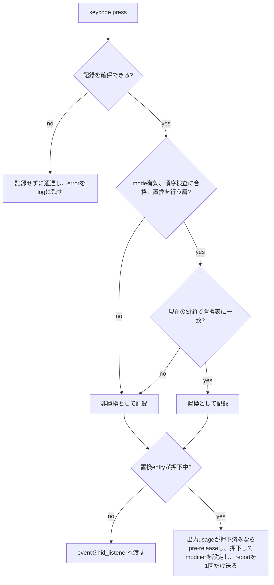
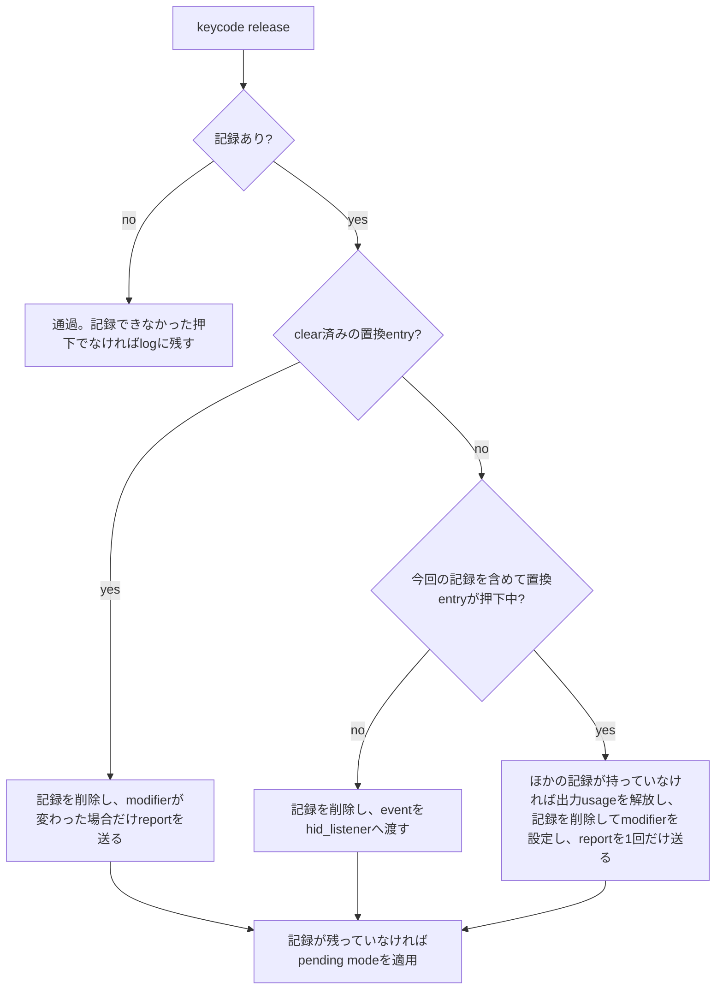
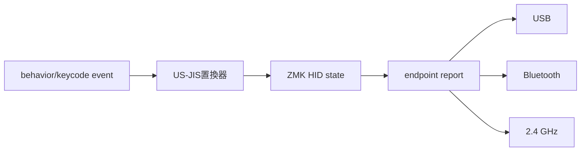

# US-JIS アーキテクチャ

> この文書は[英語版](usjis-architecture.md)の日本語訳です。内容が食い違う場合は英語版を正本とします。

`src/`のmoduleが、固定基点のKeychron ZMK上で[置換仕様](usjis-substitution.ja.md)をどう実装しているかを説明します。

## 1. 設計目標

US-JIS置換を、Keychron B1 ProのUSB、Bluetooth、独自2.4 GHzへ同じように適用し、押下・解放・modifier・長押しを破綻させないことが目標です。優先順位は次のとおりです。

1. mode無効時は基点とまったく同じに動作する。
2. キーやmodifierを押しっぱなしのまま残さない。
3. USB、Bluetooth、2.4 GHzで同じ結果を出す。
4. 長押しとホスト側key repeatを維持する。
5. Keychron ZMK本体を一切変更しない。

## 2. 固定基点

対象はKeychron ZMK `keychron_bpro` branchのcommit `c284513085c005edf5f9a52b28c8090cc6ed01d2`です。設計が依存する事実は次のとおりです。

- keycode event（`app/include/zmk/events/keycode_state_changed.h`）は`usage_page`、`keycode`、`implicit_modifiers`、`explicit_modifiers`、`state`、`timestamp`を持ちます。matrix positionはないため、キーはusageだけで識別します。
- `app/include/zmk/hid.h`には、explicit modifierの登録と解除、implicit modifierの押下と解除、masked modifierの設定と解除、usageの押下・解放・押下状態確認のAPIがあります。reportのmodifierは`(explicit & ~masked) | implicit`です。
- `app/src/hid_listener.c`はkeycode eventを受け、HID stateを更新して`zmk_endpoints_send_report()`を呼びます。`app/src/endpoints.c`はこの共通reportをUSB、Bluetooth、そして`zmk_24g_send_report()`経由で2.4 GHzへ送ります。したがって、`hid_listener`より前に置いた置換器にtransport別のコードは要りません。
- `hid_listener`は、modifierキーやconsumerのeventも含め、押下時にそのキーのimplicit modifierを代入し、解放時に全消去します。複数キーのimplicit modifierを個別追跡していないことは、`hid_listener`自身のコメントにも書かれています。置換はimplicitとmaskedのmodifierに依存するため、置換したキーの押下中は`hid_listener`にeventを処理させてはいけません。
- listenerはlink順（`.event_subscription` section）に動きます。event managerには`ZMK_EVENT_RAISE_AFTER`と`ZMK_EVENT_RELEASE`があり、指定したlistenerより後のlistenerからeventの処理を再開できます。

ソース: [hid_listener.c](https://github.com/Keychron/zmk/blob/c284513085c005edf5f9a52b28c8090cc6ed01d2/app/src/hid_listener.c)、[hid.c](https://github.com/Keychron/zmk/blob/c284513085c005edf5f9a52b28c8090cc6ed01d2/app/src/hid.c)、[keycode_state_changed.h](https://github.com/Keychron/zmk/blob/c284513085c005edf5f9a52b28c8090cc6ed01d2/app/include/zmk/events/keycode_state_changed.h)、[event_manager.c](https://github.com/Keychron/zmk/blob/c284513085c005edf5f9a52b28c8090cc6ed01d2/app/src/event_manager.c)、[endpoints.c](https://github.com/Keychron/zmk/blob/c284513085c005edf5f9a52b28c8090cc6ed01d2/app/src/endpoints.c)、[behavior_mod_morph.c](https://github.com/Keychron/zmk/blob/c284513085c005edf5f9a52b28c8090cc6ed01d2/app/src/behaviors/behavior_mod_morph.c)。

## 3. 構成要素

| ファイル | 役割 |
| --- | --- |
| `src/usjis_resolver.c` | 置換表C01〜C20。`usjis_resolve(usage, shift)`は出力usageと、出力にShiftが要るかを返す。状態も副作用も持たない |
| `src/usjis.c` | 押下記録、modifier方針、keycodeとendpointのlistener、modeの状態、settingsの永続化、起動時の順序検査 |
| `src/behavior_usjis.c` | `&usjis` behavior（`USJIS_OFF`、`USJIS_ON`、`USJIS_TOG`）。押下で動作し、ホストへは何も送らない |
| `include/zmk/usjis.h` | moduleのAPI。modeの要求と状態、押下記録の数、listener順序の検査結果、settings書込みの回数 |
| `dts/bindings/behaviors/zmk,behavior-usjis.yaml`、`include/dt-bindings/zmk/usjis.h` | `&usjis`のdevicetree bindingとparameter |
| `CMakeLists.txt`、`Kconfig`、`zephyr/module.yml` | moduleの登録、listenerの配置（第6節）、option |

option（`Kconfig`）:

| option | 既定値 | 意味 |
| --- | --- | --- |
| `CONFIG_ZMK_USJIS` | `y` | moduleをbuildする |
| `CONFIG_ZMK_USJIS_DEFAULT_ENABLED` | `n` | 有効な設定が保存されていないときのmode |
| `CONFIG_ZMK_USJIS_MAX_ENTRIES` | 82 | 押下記録の容量（物理キー数以上） |
| `CONFIG_ZMK_USJIS_LAYER_MASK` | `0x04` | 置換を行う層。`0x04`は層2で、OS切替スイッチのWin側。0はすべての層 |
| `CONFIG_ZMK_USJIS_SETTINGS_SAVE_DELAY_MS` | 2000 | 適用したmodeを保存するまでの遅延 |
| `CONFIG_ZMK_USJIS_LOG_LEVEL` | 1 | moduleのlog level |

## 4. 押下記録

keyboard pageの非modifierキーの押下は、置換したかどうかにかかわらず、解放まで記録を持ちます。

```text
entry:
  input_usage        usage of the key as pressed (the key's identity)
  substituted
  output_usage       usage pressed in the HID report
  added              modifiers the key asks to add
  masked             modifiers the key asks to remove
  order              press order
  cleared            the HID state was cleared by an endpoint switch
  non_shift_dropped  conflict rule 5: its Ctrl/Alt/GUI request is not restored
```

- 置換entryは、`added` = 出力にShiftが要る場合のLeft Shiftと、eventのimplicit modifierのうちShift以外、`masked` = 左右Shiftです。非置換entryは、`added` = eventのimplicit modifier、`masked` = 0です。
- 解放時はusageで記録を検索し、保存済みの出力を解放します。resolverを再実行しないため、解放時のShift状態やmodeは影響しません。
- 記録は入力usageで識別します。すでに押下中のusageが再び押されると（key repeatによる再送、macro、2か所に割り当てた同じusage）、前の記録を置き換えます。同じusageを2か所へ割り当てることはサポートしません（S09）。
- 出力usageは、そのusageをreportしている押下中の記録がほかにないときだけ解放します。C09と物理MINUSキーはどちらも`0x2D`を出力し、片方を離してももう片方が押下中なら`0x2D`は押されたままです。
- 記録は`CONFIG_ZMK_USJIS_MAX_ENTRIES`（82、B1 Proのmatrix position数）の固定長配列なので、物理キーでは超過しません。容量を超えた押下は置換せずに通し、数を数えてerrorとしてlogに残します。そのような押下がある間は、mode変更はpendingのままです。

## 5. modifierの計算

clear済みでない置換entryが1個以上押下中の間、reportのmodifierは仕様第6節の競合方針に従います。`latest`は、clear済みでない記録のうち最後に押されたものです。

```text
reported = (physical & ~masked(latest)) | added(latest)
```

- `physical`はexplicit modifier、つまり物理modifierキーの状態です。置換で付加したShiftは物理Shiftではありません。
- 置換器はこれをHID stateを通して適用します（`zmk_hid_masked_modifiers_set(masked)`と`zmk_hid_implicit_modifiers_press(added)`）。Mod-Morphや`hid_listener`が知らせずに上書きするため、reportを送る前に毎回両方を設定し直します。
- `latest`に`non_shift_dropped`が付いている場合は、`added`のうちShiftの部分だけを使います（競合規則5と6）。
- 置換entryが押下中でなくなったら、implicit modifierを解除し、maskを消去して、以降は`hid_listener`に任せます（競合規則7）。押下中のMod-Morphキーが設定したmaskは戻しません。

modifierはreport全体へ作用し、個別のキーには所属しません。後のキーを押している間、先に押したキーは自分の要求と異なるmodifierの下で押下状態が続きます。これは状態管理では解消できないHID reportの制約です。key repeatを維持するため、置換器は押下を押下のまま扱います（tapへ変換しません）。

## 6. listenerの配置と起動時の検査

listenerは、keycode eventを捕捉して再送するbehavior（hold-tap、sticky key、caps word、key repeat）より後、`hid_listener`より前で動く必要があります。key repeatより前だと再送されたeventを二重に置換し、hold-tapより前だと、hold-tapが後で保留するmodifierのeventを見てしまいます。

moduleのソースは通常、application自身のソースより前に追加されるため、そのままではlistenerが先頭になります。`CMakeLists.txt`はmoduleのソースをZMKの`app` libraryへ追加し、`cmake_language(DEFER)`で、application directoryの処理後に`src/usjis.c`を`hid_listener.c`の直前へ移します。`hid_listener.c`が見つからなければconfigureが失敗します。

起動時に`usjis.c`は`.event_subscription` sectionを読み、自分のlistenerがhold-tapとkey repeatより後、`hid_listener`より前にあることを検査します。検査に失敗したらerrorをlogに残し、置換を一切行いません。キーボードは基点どおりに動作します。

## 7. event処理

listenerは`zmk_keycode_state_changed`と`zmk_endpoint_changed`を購読します。keycode eventを置換器自身が処理するときは、HID stateを更新してreportを送り、`zmk_event_manager_raise_after`で`hid_listener`より後のlistener（`ble.c`、Launcher）からeventの処理を再開して、`ZMK_EV_EVENT_CAPTURED`を返します。そのため`hid_listener`はそのeventを見ません。

### 非modifierキーの押下



照合に使うShiftはexplicit modifierとeventのimplicit modifierの和なので、`&kp PLUS`（`LS(EQUAL)`）はC10に一致します。

### 非modifierキーの解放



`M`で今回解放する記録を含めて数えるため、ほかの置換キーが残る場合（競合規則5）も、最後の置換キーを解放する場合（競合規則7）も、置換器はkey upと新しいmodifierを1件のreportで送ります。解放を`hid_listener`へ渡すと、出力usageではなく入力usageを解放してしまい、新しい`latest`が付加Shiftやmaskを要求する場合はreportが2件になります。

### modifierキーとconsumer/system usage

置換entryが押下中の間は、これらのeventも置換器が処理します。usageを押下または解放し、explicit modifierを登録または解除し、第5節に従ってmodifierを設定してreportを送ります。modifierキーのeventでは常にkeyboard reportを送ります（競合規則6）。consumerやsystemのeventでは、modifierが変わった場合だけkeyboard reportを送り、そのあと自分のpageのreportを送ります。これがないと`hid_listener`がimplicit modifierを消去し、途中のreportで付加Shiftが消えます（S19）。置換entryが押下中でない間は、これらのeventはそのまま`hid_listener`へ渡します。

## 8. endpoint切替

基点がHID reportをclearするのは、`NONE`以外のtransportから切り替わるときだけです（仕様第7節）。`zmk_endpoint_changed`で置換器は、押下中の記録の出力usageのうち、HID stateで押されていないものがあるかを確認します。あればclearが起きたと判断し、すべての記録を`cleared`にして、modifierを基点の状態へ戻します。clearを伴わない切替では出力usageはすべて押されたままで、何も変わりません。clear済みの置換entryは、新しいendpointへ出力usageの解放を送りません。

## 9. modeとsettings

`zmk_usjis_request()`は仕様第3節と第7節を実装します。

- 基準は、pendingの要求があればそれ、なければ実効状態です。基準と同じ要求は何もしません。
- 記録が1個でも押下中か、記録できなかった押下が残っている間は、要求をpendingにします。実効状態と同じ要求はpendingを取り消します。pending modeは最後の記録の解放時に適用します。
- 保存するのは適用したmode変更だけです。

modeはZephyr Settingsに`usjis/mode`として、2 byteのrecord（`version` = 1、`enabled` = 0または1）で保存します。保存は変更から`CONFIG_ZMK_USJIS_SETTINGS_SAVE_DELAY_MS`（2秒）後に予約するため、続けて切り替えてもflashへの書込みは1回です。基点自身のsettings debounce（`CONFIG_ZMK_SETTINGS_SAVE_DEBOUNCE`、60秒）は使いません。その間に電源を切るとmodeが失われるためです。起動時、recordがない、長さが違う、versionが未知、値が不正のいずれかなら、既定値（`DISABLED`）のままにして理由をlogに残します。保存に失敗した場合はlogに残し、入力処理は続けます。キーボードのfactory resetはこのrecordを消しません。

## 10. adaptive NKRO（`keychron_b1_usn`）

n版（PID `0x071a`）のadaptive NKROのHIDコードでは、implicitやmaskedのmodifierだけが変わっても送信flag `KB_RPT`が立たず、そのreportはUSBとBluetoothへ送られません（`endpoints.c`の`kb_changed()`）。置換器はそのようなreportに依存しません。置換器が送るreportはすべて、usageの押下か解放、またはexplicit modifierのeventと一緒に送られ、それらは`KB_RPT`を立てるためです。この構成で失われ得るreportは、endpointのclear直後の再計算だけで、次のkey eventが正しいmodifierを運びます。`usjis-adaptive`のシミュレーションvariantが、このHIDコードでtestを実行します。

## 11. transport境界

置換器はendpoint種別を参照しません。reportを送る前の共通HID stateに作用し、その後は既存経路に任せます。



binary libraryである2.4 GHzの経路にはUS-JISのコードはありません。transportによって挙動が違う場合は、共通経路に入る前のreportと、受信側で採取したreport（2.4 GHzならdongleのUSB report）を比較します。

## 12. log

置換器は`CONFIG_ZMK_USJIS_LOG_LEVEL`のlevelで次をlogに残します。

- error: listener順序検査の失敗、押下記録の容量超過、report送信の失敗、不正または読めないsettings、保存の失敗。
- warning: 押下記録のない解放。
- information: mode変更、pendingの要求、復元したmode、検知したendpointのclear。

通常のtypingはdebugより上のlevelではlogに出しません。
