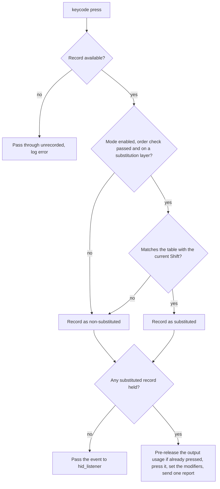
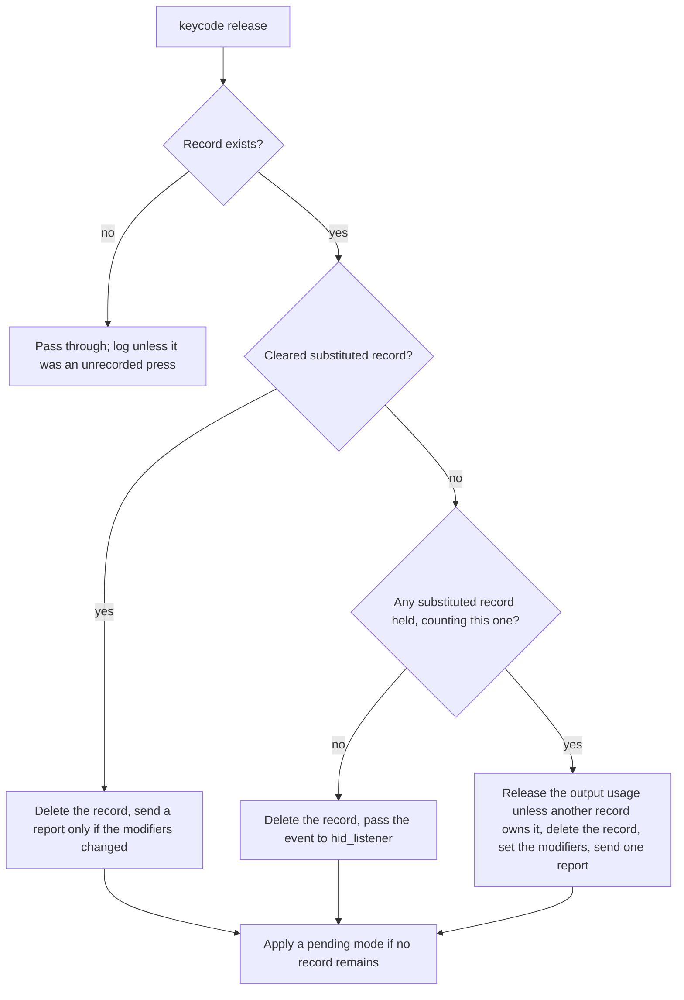
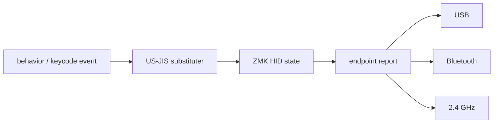

# US-JIS Architecture

How the module in `src/` implements the [substitution spec](usjis-substitution.md) on top of the pinned Keychron ZMK.

## 1. Design goals

US-JIS substitution applies to USB, Bluetooth and the proprietary 2.4 GHz link of the Keychron B1 Pro in the same way, without breaking press, release, modifiers or long presses. In order of priority:

1. With the mode disabled, behave exactly like the baseline.
2. Never leave a key or a modifier stuck.
3. Produce the same result on USB, Bluetooth and 2.4 GHz.
4. Keep long presses and host-side key repeat working.
5. Change nothing in Keychron ZMK itself.

## 2. The pinned baseline

The target is commit `c284513085c005edf5f9a52b28c8090cc6ed01d2` of Keychron ZMK, branch `keychron_bpro`. The facts the design relies on:

- The keycode event (`app/include/zmk/events/keycode_state_changed.h`) carries `usage_page`, `keycode`, `implicit_modifiers`, `explicit_modifiers`, `state` and `timestamp`. It has no matrix position, so the usage alone identifies the key.
- `app/include/zmk/hid.h` has APIs to register and unregister explicit modifiers, press and release implicit modifiers, set and clear masked modifiers, and press, release and query usages. The report's modifiers are `(explicit & ~masked) | implicit`.
- `app/src/hid_listener.c` receives the keycode event, updates the HID state and calls `zmk_endpoints_send_report()`. `app/src/endpoints.c` sends this common report to USB, Bluetooth and, through `zmk_24g_send_report()`, 2.4 GHz. A substituter placed before `hid_listener` therefore needs no per-transport code.
- `hid_listener` assigns the implicit modifiers of a key on press and clears all of them on release, including for modifier keys and consumer events. Its own comment says that implicit modifiers of several keys are not tracked individually. Substitution depends on implicit and masked modifiers, so the module must not let `hid_listener` process events while a substituted key is held.
- Listeners run in link order (the `.event_subscription` section). The event manager has `ZMK_EVENT_RAISE_AFTER` and `ZMK_EVENT_RELEASE`, which continue an event with the listeners after a given one.

Sources: [hid_listener.c](https://github.com/Keychron/zmk/blob/c284513085c005edf5f9a52b28c8090cc6ed01d2/app/src/hid_listener.c), [hid.c](https://github.com/Keychron/zmk/blob/c284513085c005edf5f9a52b28c8090cc6ed01d2/app/src/hid.c), [keycode_state_changed.h](https://github.com/Keychron/zmk/blob/c284513085c005edf5f9a52b28c8090cc6ed01d2/app/include/zmk/events/keycode_state_changed.h), [event_manager.c](https://github.com/Keychron/zmk/blob/c284513085c005edf5f9a52b28c8090cc6ed01d2/app/src/event_manager.c), [endpoints.c](https://github.com/Keychron/zmk/blob/c284513085c005edf5f9a52b28c8090cc6ed01d2/app/src/endpoints.c), [behavior_mod_morph.c](https://github.com/Keychron/zmk/blob/c284513085c005edf5f9a52b28c8090cc6ed01d2/app/src/behaviors/behavior_mod_morph.c).

## 3. Components

| File | Role |
| --- | --- |
| `src/usjis_resolver.c` | The substitution table C01–C20. `usjis_resolve(usage, shift)` returns the output usage and whether the output needs Shift. No state, no side effects |
| `src/usjis.c` | Press records, the modifier policy, the keycode and endpoint listener, the mode state, settings persistence and the startup order check |
| `src/behavior_usjis.c` | The `&usjis` behavior (`USJIS_OFF`, `USJIS_ON`, `USJIS_TOG`). Acts on the press, sends nothing to the host |
| `include/zmk/usjis.h` | The module's API: mode request and state, number of press records, listener order result, number of settings writes |
| `dts/bindings/behaviors/zmk,behavior-usjis.yaml`, `include/dt-bindings/zmk/usjis.h` | Devicetree binding and parameters of `&usjis` |
| `CMakeLists.txt`, `Kconfig`, `zephyr/module.yml` | Module registration, listener placement (section 6) and options |

Options (`Kconfig`):

| Option | Default | Meaning |
| --- | --- | --- |
| `CONFIG_ZMK_USJIS` | `y` | Build the module |
| `CONFIG_ZMK_USJIS_DEFAULT_ENABLED` | `n` | Mode when no valid setting is stored |
| `CONFIG_ZMK_USJIS_MAX_ENTRIES` | 82 | Press record capacity (at least the number of physical keys) |
| `CONFIG_ZMK_USJIS_LAYER_MASK` | `0x04` | Layers on which substitution applies; `0x04` is layer 2, the Win position of the OS switch. 0 means all layers |
| `CONFIG_ZMK_USJIS_SETTINGS_SAVE_DELAY_MS` | 2000 | Delay before an applied mode is saved |
| `CONFIG_ZMK_USJIS_LOG_LEVEL` | 1 | Log level of the module |

## 4. Press records

Every press of a non-modifier key on the keyboard page gets a record, substituted or not, until its release:

```text
entry:
  input_usage        usage of the key as pressed (the key's identity)
  substituted
  output_usage       usage pressed in the HID report
  added              modifiers the key asks to add
  masked             modifiers the key asks to remove
  order              press order
  cleared            the HID state was cleared by an endpoint switch
  non_shift_dropped  conflict rule 5: its Ctrl/Alt/GUI request is not restored
```

- A substituted record has `added` = Left Shift if the output needs Shift, plus the event's implicit modifiers other than Shift, and `masked` = both Shifts. A non-substituted record has `added` = the event's implicit modifiers and `masked` = 0.
- On release, the module looks the record up by usage and releases the stored output. It never re-runs the resolver, so the Shift state or the mode at release does not matter.
- Records are identified by the input usage. A second press of a usage that is already held (key repeat re-sending it, a macro, or the same usage on two positions) replaces the earlier record. Assigning the same usage to two positions is not supported (S09).
- An output usage is released only when no other held record reports it. C09 and the physical MINUS key both output `0x2D`; releasing one while the other is held keeps `0x2D` pressed.
- The records are a fixed array of `CONFIG_ZMK_USJIS_MAX_ENTRIES` (82, the number of matrix positions of the B1 Pro), so physical keys never exceed it. A press beyond the capacity is passed through unsubstituted, counted, and logged as an error; while such a press is held, a mode change stays pending.

## 5. Modifier computation

While at least one substituted record that is not cleared is held, the report's modifiers follow the conflict policy of spec section 6. `latest` is the most recently pressed record that is not cleared:

```text
reported = (physical & ~masked(latest)) | added(latest)
```

- `physical` is the explicit modifiers, the state of the physical modifier keys. Shift added by substitution is not physical.
- The module applies this through the HID state: `zmk_hid_masked_modifiers_set(masked)` and `zmk_hid_implicit_modifiers_press(added)`. It sets both again before each report it sends, because Mod-Morph and `hid_listener` overwrite them without notice.
- If `latest` has `non_shift_dropped`, only the Shift part of `added` is used (conflict rules 5 and 6).
- When no substituted record is held, the module releases the implicit modifiers, clears the mask and leaves everything to `hid_listener` (conflict rule 7). A mask set by a held Mod-Morph key is not restored.

Modifiers belong to the whole report, not to a key. While a later key is held, an earlier key stays pressed under modifiers that differ from its own request. This is a limit of the HID report that no state management removes. The module keeps presses as presses (no conversion to taps) so that key repeat keeps working.

## 6. Listener placement and startup check

The listener must run after the behaviors that capture and re-raise keycode events (hold-tap, sticky key, caps word, key repeat) and before `hid_listener`. If it ran before key repeat, a repeated event would be substituted twice; if it ran before hold-tap, it would see modifier events that hold-tap later defers.

A module's sources are normally added before the application's own sources, which would put the listener first. `CMakeLists.txt` adds the module's sources to the ZMK `app` library and, with `cmake_language(DEFER)`, moves `src/usjis.c` to just before `hid_listener.c` after the application directory is processed. The configure step fails if `hid_listener.c` is not found.

At startup, `usjis.c` reads the `.event_subscription` section and checks that its listener comes after hold-tap and key repeat and before `hid_listener`. If the check fails, the module logs an error and never substitutes; the keyboard works as the baseline.

## 7. Event handling

The listener subscribes to `zmk_keycode_state_changed` and `zmk_endpoint_changed`. When the module handles a keycode event itself, it updates the HID state, sends the report, continues the event with the listeners after `hid_listener` (`ble.c`, the Launcher) through `zmk_event_manager_raise_after`, and returns `ZMK_EV_EVENT_CAPTURED`, so `hid_listener` does not see it.

### Press of a non-modifier key



Shift for matching is the union of the explicit modifiers and the event's implicit modifiers, so `&kp PLUS` (`LS(EQUAL)`) matches C10.

### Release of a non-modifier key



Counting the record being released at `M` makes the module send the key up and the new modifiers in one report, both when another substituted key remains (conflict rule 5) and when the last one is released (conflict rule 7). Passing the release to `hid_listener` would release the input usage instead of the output usage, and would send two reports when the new `latest` asks for an added Shift or a mask.

### Modifier keys and consumer or system usages

While a substituted record is held, the module also handles these events: it presses or releases the usage, registers or unregisters the explicit modifiers, sets the modifiers by section 5 and sends the report. A modifier key event always sends a keyboard report (conflict rule 6); a consumer or system event sends a keyboard report only if the modifiers changed, then the report of its own page. Without this, `hid_listener` would clear the implicit modifiers and the added Shift would disappear from intermediate reports (S19). While no substituted record is held, these events go to `hid_listener` unchanged.

## 8. Endpoint switch

The baseline clears the HID report only when it switches away from a transport that is not `NONE` (spec section 7). On `zmk_endpoint_changed`, the module checks whether the output usage of any held record is no longer pressed in the HID state. If so, a clear happened: all records are marked `cleared`, and the modifiers go back to the baseline. A switch without a clear leaves every output usage pressed and changes nothing. A cleared substituted record sends no release of its output usage to the new endpoint.

## 9. Mode and settings

`zmk_usjis_request()` implements spec sections 3 and 7:

- The basis is the pending request if there is one, otherwise the effective mode. A request equal to its basis is a no-op.
- While any record is held, or an unrecorded press is outstanding, the request becomes pending. A request equal to the effective mode cancels the pending one. The pending mode is applied when the last record is released.
- Only applied mode changes are saved.

The mode is stored in Zephyr Settings as `usjis/mode`, a two-byte record (`version` = 1, `enabled` = 0 or 1). A save is scheduled `CONFIG_ZMK_USJIS_SETTINGS_SAVE_DELAY_MS` (2 s) after the change, so repeated toggles give one flash write. The baseline's own settings debounce (`CONFIG_ZMK_SETTINGS_SAVE_DEBOUNCE`, 60 s) is not used, because a power cycle within that time would lose the mode. At startup, a missing record, a wrong length, an unknown version or an invalid value keeps the default (`DISABLED`) and logs the reason. A failed save is logged; input processing continues. The keyboard's factory reset does not delete this record.

## 10. Adaptive NKRO (`keychron_b1_usn`)

In the adaptive NKRO HID code of the n version (PID `0x071a`), a change of only the implicit or masked modifiers does not set the send flag `KB_RPT`, so such a report is not sent to USB or Bluetooth (`kb_changed()` in `endpoints.c`). The module does not depend on such reports: every report it sends goes with a usage press or release or an explicit modifier event, which set `KB_RPT`. The only report it may lose in this configuration is the recalculation right after an endpoint clear; the next key event carries the correct modifiers. The `usjis-adaptive` simulation variant runs the tests on this HID code.

## 11. Transport boundary

The module does not look at the endpoint type. It works on the common HID state before the report is sent, and the existing path takes over from there.



There is no US-JIS code in the 2.4 GHz path, which is a binary library. If a transport behaves differently, compare the report before it enters the common path with the report captured on the receiving side (for 2.4 GHz, the USB reports of the dongle).

## 12. Logging

The module logs, at the level `CONFIG_ZMK_USJIS_LOG_LEVEL`:

- errors: listener order check failure, press record capacity exceeded, report send failure, invalid or unreadable settings, save failure;
- warnings: a release without a press record;
- information: mode changes, pending requests, a restored mode, a detected endpoint clear.

Normal typing is not logged above the debug level.
